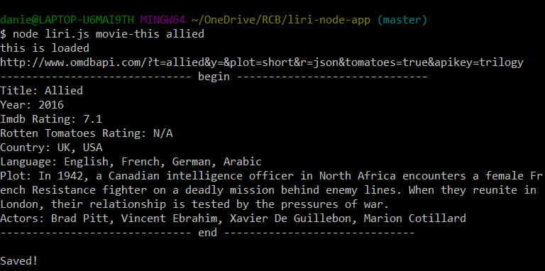

# Liri-Node-App

## Overview

LIRI is a Language Interpretation and Recognition Interface. LIRI  takes in parameters to retrieve data from Twitter, Spotify, OMDB APIs and display in the command line using node.js.

## Instructions
Open Git Bash (Windows) or terminal (Mac/Linux) and run the following command: https://github.com/danielladt/liri-node-app.git

#### The user can write one of the 3 commands: 

*Search Twitter for tweets: node liri.js my-tweets <twitter User Name>
*Search Spotify: node liri.js spotify-this-song "Song Name" (be sure to include quotes)
*Search OMDB for Movie Information: node liri.js movie-this "movie" (be sure to include quotes)
*Run random command: node.js liri do-what-it-says

